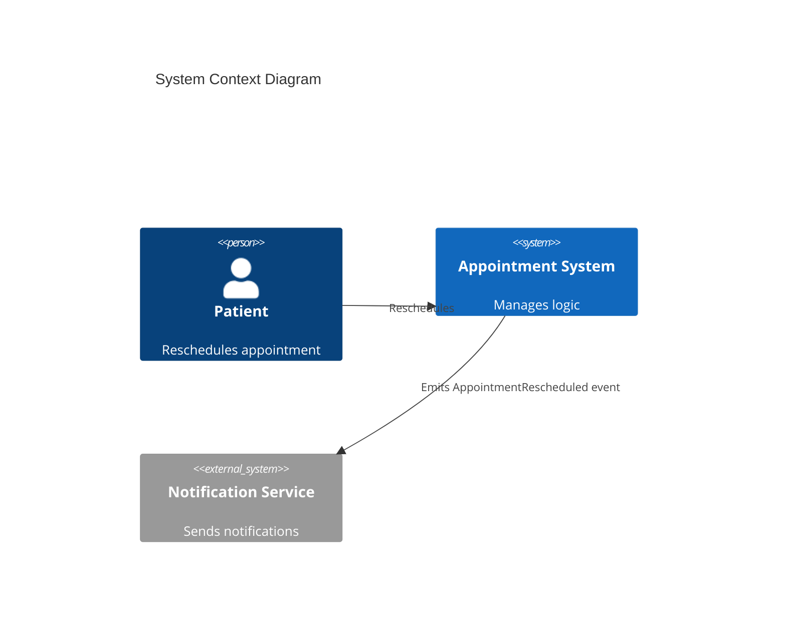

# Week 3 Assignment - Appointment Rescheduling

## 1. Context Diagram



## 2. User Story

As a Patient, I want to reschedule my appointment within 24 hours so that I can change it with a late-change flag.

## 3. Acceptance Criteria (Gherkin)

```gherkin
Feature: Appointment Rescheduling within 24-hour window
  Scenario: Patient reschedules an appointment within 24 hours of window
    Given a patient has a scheduled appointment for "2026-10-15T10:00:00Z"
    When the patient requests a reschedule to "2026-10-16T14:00:00Z" less than 24 hours before the original time
    Then the system should apply a late-change flag
    And emit an "AppointmentRescheduled" event to the Notification Service
    And display a confirmation message with updated details to the patient
```
